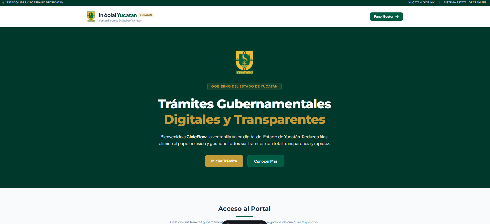
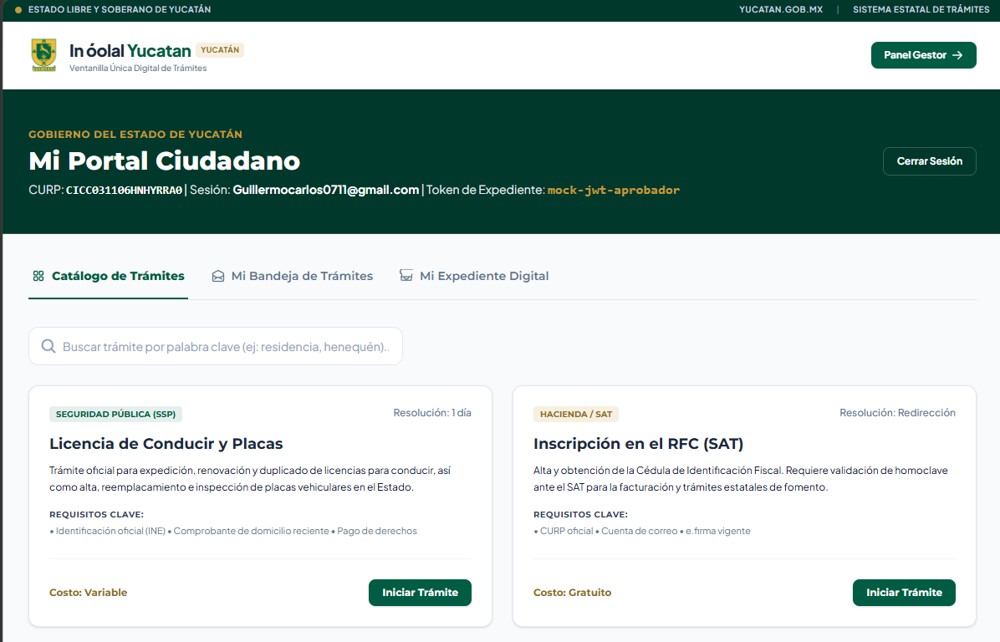
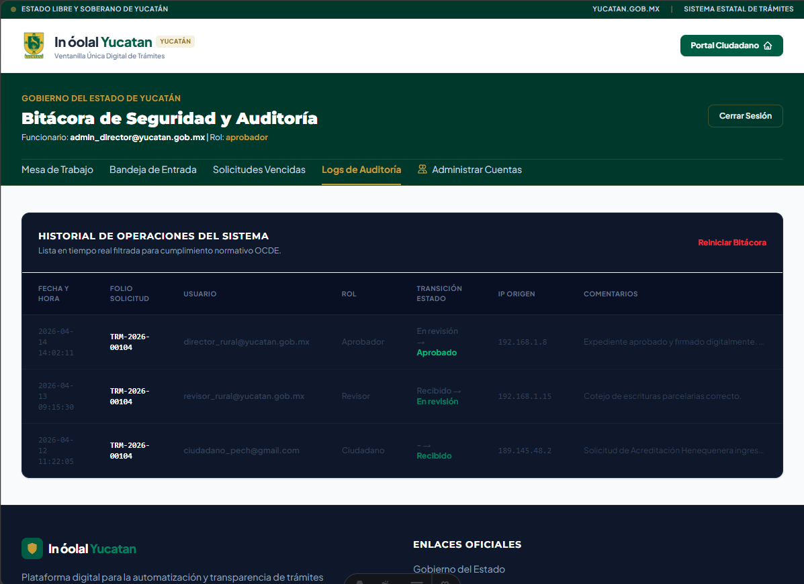
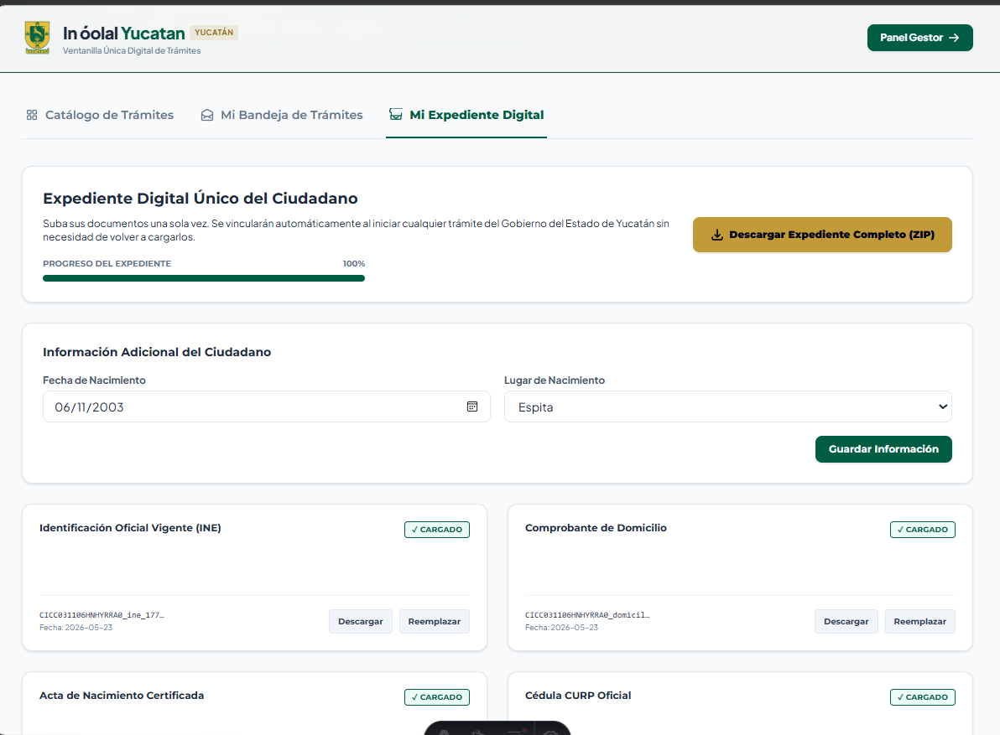
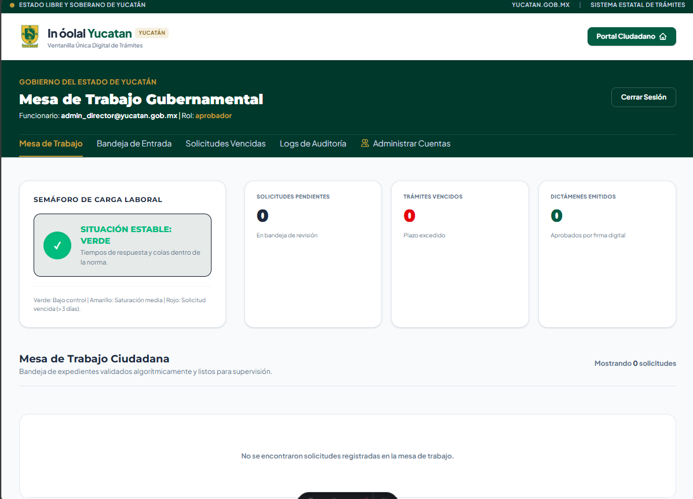

# In óolal MVP platform

> A high-performance digital platform designed to streamline citizen reporting and accelerate government bureaucratic processes.

---

## Hackatec 2026 Submission
*This project was developed collaboratively during the Hackatec hackathon. My primary contributions included leading the **frontend development and architecture with Astro** to ensure high performance, as well as overseeing **security configurations** and full-stack integration with the database.*

---

## Project Context

This system was engineered to eliminate bureaucratic bottlenecks through a dual-interface architecture serving both citizens and public administrators. When a citizen uploads their identity documents, the system automatically generates a unified digital file and issues a secure token. This token unlocks a catalog of procedures, allowing the user to initiate specific government requests. On the administrative side, the platform functions as a CRM, giving public servants full visibility over procedure histories and workflow statuses.

---

## Tech Stack & Architecture

* **Frontend:** Built with **Astro**, leveraging native **HTML5, CSS3, and JavaScript** to guarantee near-instantaneous load times and a highly optimized rendering process, crucial for accessible public platforms.
* **Backend & Database:** Integrated with **Supabase** (PostgreSQL) and structured using **SQL** for robust data querying, secure real-time storage, and identity management.

---

## Key Features

* **Digital File & Token Issuance:** Secure document upload that automatically generates a citizen's digital file and a unique access token.
* **Token-Gated Procedure Catalog:** A dynamic interface where authenticated citizens can select and initiate specific bureaucratic procedures.
* **Administrative CRM:** A centralized dashboard for government officials to monitor procedure histories, manage incoming requests, and oversee workflows.

---

---

## Platform Preview

  
  
<em>The main landing page and entry point for the platform.</em>

 

  
  
<em>The authenticated citizen portal showcasing the complete catalog of available public services.</em>

 

  
  
<em>Personal tracking dashboard displays a comprehensive history of the user's requested services.</em>

 

  
  
<em>Automated system verification that issues a secure access token once all required identity documents are uploaded.</em>

 

  
  
<em>The internal administrative dashboard engineered for government agents to oversee and process incoming applications.</em>

 CRM dashboard for tracking public procedures and history.</em>

